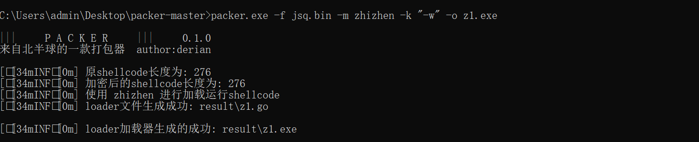
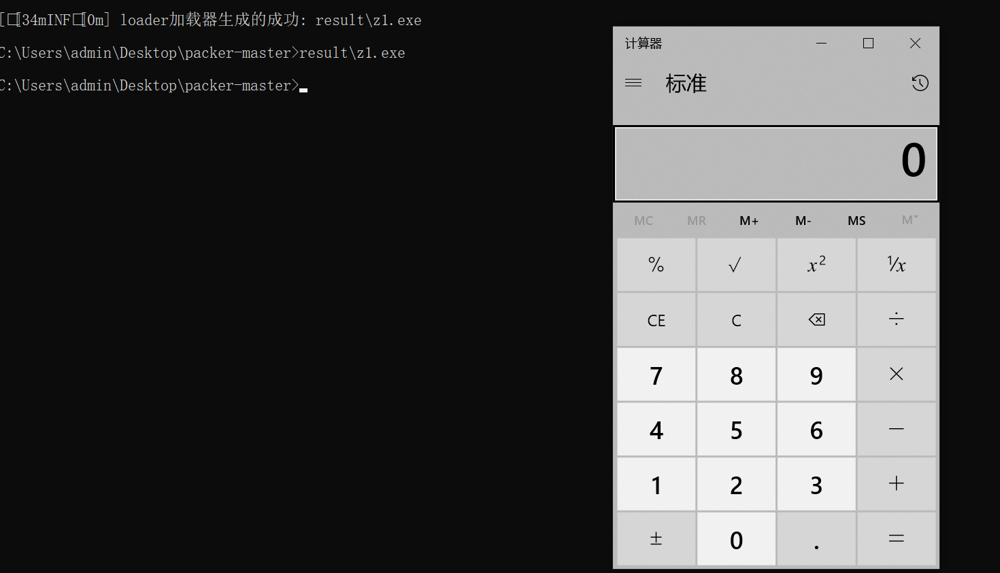
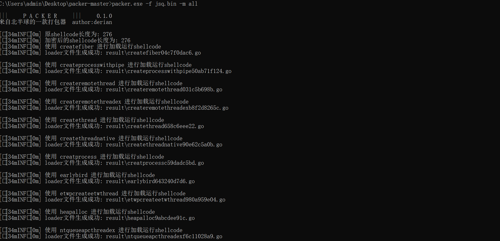
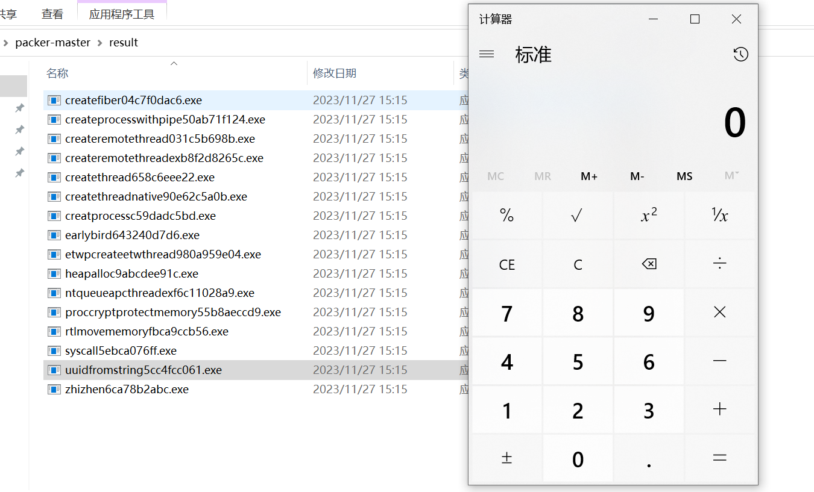

## 1.工具介绍

packer 是一款针对cs生成的shellcode快速打包成exe的一款工具, 内置了16种加载方式提供选择, 针对shellcode只是简单的进行了异或的处理, 并没有添加过多的免杀处理, 所以这只是本项目只是一个快速打包器, 如果刚好生成的exe是免杀的, 那么恭喜你 !

**!!!注意不是免杀项目**

**!!!注意不是免杀项目**

**!!!注意不是免杀项目**

重要的事情说三遍

下个版本会优化一下代码进行开源, 增加更多的shellcode加载方式, 更加方便各位师傅增加免杀处理代码和自己的编写shellcode加载模板

## 2.运行环境

操作系统

- windows

go 版本

- 1.20.x

因为本项目打包exe使用的是go编译, 所以需要使用者本地存在go语言环境

## 3.工具使用

直接下载本项目, 解压

运行

```
go mod init packer
```

下载打包需要的依赖

```
go get github.com/gonutz/ide
go get github.com/google/uuid
go get github.com/mitchellh/go-ps
go get golang.org/x/sys
```

参数说明

```
packer.exe -h

|||     P A C K E R     |||     0.1.0
来自北半球的一款打包器  author:derian

packer

Usage:
  packer.exe [flags]

Flags:
INPUT:
   -f, -file string  input a cs .c/.bin file
   -m, -mode string  shellcode running mode
   -k, -key string   -w,-s,-w -s compilation parameters

MODE:
   -list  list shellcode running modes

OUTPUT:
   -o, -output string  output a .exe file (default "output.exe")
```

其中 -f 指定的是cs生成的shellcode文件, 支持payload.c, payload.bin, 以及beacon.bin

-m 指定shellcode加载方式

-list 查看支持的加载方式有哪些

-k go编译时的参数

## 4.工具演示

查看支持的加载方式

```
packer.exe -list
```


指定加载shellcode加载方式

```
packer.exe -f jsq.bin -m zhizhen -k "-w" -o z1.exe
```



运行 z1.exe 测试



所有加载方式全部打包一遍

```
packer.exe -f jsq.bin -m all
```





## 5.免责声明

该工具仅供个人学习和研究使用。作者不对您使用该工具所产生的任何后果负任何法律责任。

最新版本, 关注公众号后台回复 packer 即可领取


参考

https://github.com/TideSec/GoBypassAV